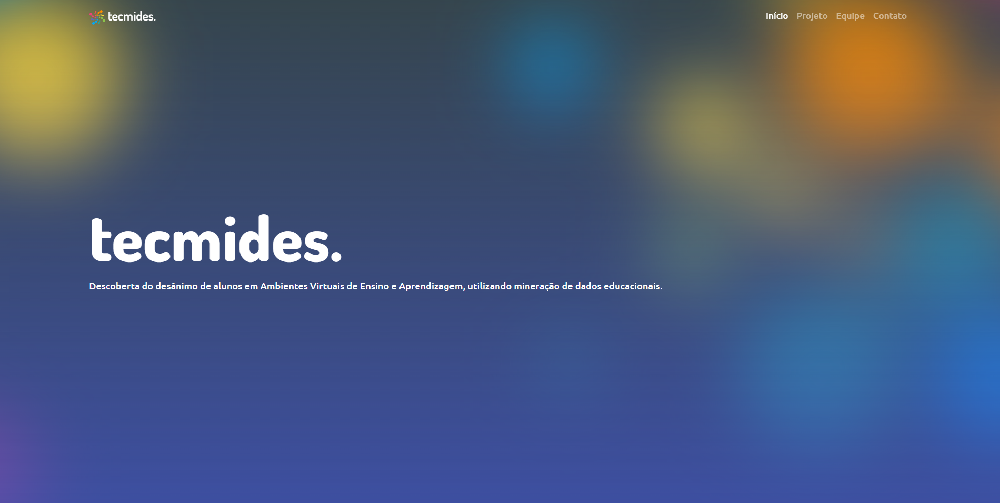

<h1 align="center">📊 TECMIDES</h1>

  <strong>Landing page oficial do projeto de Iniciação Científica desenvolvido na <a href="https://www.ufrgs.br" target="_blank">UFRGS</a></strong> 
  <em>Descoberta do Desânimo de Alunos em Ambientes Virtuais de Ensino e Aprendizagem</em>

  <a href="https://diegocarmn.github.io/tecmides/">🌐 Acesse o site</a>

---

## 🧠 Sobre o projeto

Este repositório contém apenas o **site institucional** do projeto **TECMIDES** — uma iniciativa de pesquisa que visa desenvolver modelos computacionais para **identificar alunos desanimados** em cursos de educação a distância (EAD), com foco na permanência estudantil.

O projeto principal envolve:
- Mineração de Dados Educacionais (MDE)
- Desenvolvimento de um modelo preditivo
- Criação de um plugin para Moodle (fora deste repositório)

Essa landing page foi criada para apresentar os objetivos, resultados e contexto da pesquisa de forma clara e acessível ao público.

---

## 🖼 Preview

  

---

## 🚀 Tecnologias utilizadas

- **HTML5**
- **CSS3**
- **Bootstrap**
- **JavaScript**
- **GitHub Pages** (deploy)

---

## 🧪 Sobre a pesquisa

> **TECMIDES** — *Descoberta do Desânimo de Alunos em Ambientes Virtuais de Ensino e Aprendizagem Utilizando Mineração de Dados Educacionais* — tem como foco desenvolver uma ferramenta para uso em ambientes como o Moodle, capaz de identificar, por meio de um modelo preditivo, estudantes com sinais de desânimo.

Com isso, professores podem acompanhar melhor seus alunos e agir preventivamente para evitar a evasão.

---

## 📜 Licença

Este projeto está licenciado sob a **MIT License**. Veja o arquivo [LICENSE](LICENSE) para mais detalhes.

---

  Feito com 💜 por Diego Carmona

